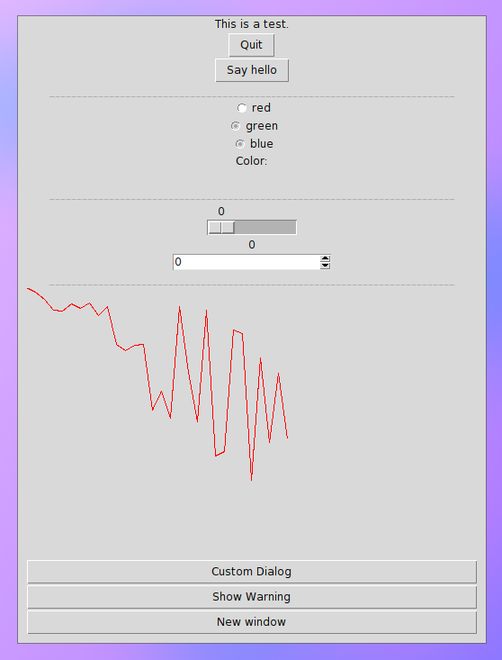
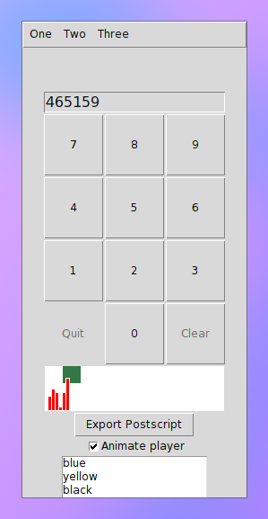
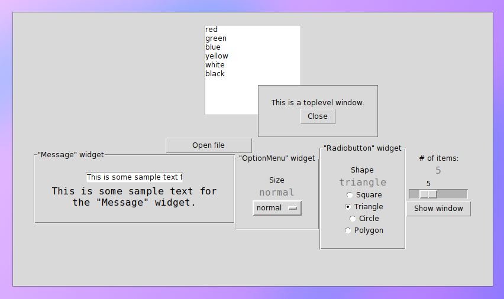
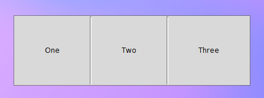

# Tkinter GUI Demos

A compilation of various Tk user interface elements

## gui.py

```
python gui.py
```



## numpad.py

```
python numpad.py
```



## widgets.py

```
python widgets.py
```



## panes.py

```
python panes.py
```


